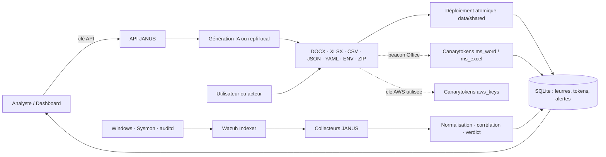

# 🍯 HoneyDoc JANUS

JANUS est un prototype universitaire défensif de cyberdéception. Il génère des
fichiers-appâts crédibles, les déploie dans une zone surveillée, conserve leur
identité dans SQLite et corrèle leurs interactions avec Wazuh, Windows, Sysmon,
Linux `auditd` et Canarytokens.

Le projet n'essaie pas d'inventer des preuves. Une adresse IP, un système
d'exploitation, une action ou un point d'entrée ne sont affichés que si une
source identifiée les fournit, avec leur niveau de confiance et leurs limites.

## Périmètre livré

| Fonction | État |
|---|---|
| Génération DOCX narrative, sans macro | opérationnelle |
| Génération XLSX comptable cohérente, sans macro | opérationnelle |
| Génération CSV, JSON, YAML, `.env` et ZIP | opérationnelle |
| Leurres `financial_report`, `hr_document`, `technical_config`, `cloud_credentials` | opérationnels |
| Déploiement contrôlé sous `data/shared` + SHA-256 + registre SQLite | opérationnel |
| SACL Windows + événements 4663 + règles Wazuh 100100–100104 | opérationnels |
| Télémétrie Windows 4624/4663/4688/5145, Sysmon et Linux `auditd` | opérationnelle si les capteurs sont configurés |
| Collecte automatique Wazuh Indexer + déduplication + reprise par curseur | opérationnelle |
| Canarytokens distant, avec échec fermé si le fournisseur est absent ou indisponible | opérationnel selon la configuration réseau |
| Canarytoken `aws_keys` pour les leurres `cloud_credentials` | opérationnel ; alerte lors de l'utilisation AWS, pas à l'ouverture |
| Rétention bornée de la télémétrie de contexte, preuves JANUS protégées | opérationnelle |
| Pixel local de développement | explicite, jamais présenté comme un Canarytoken officiel |
| Faux HTTP/SSH et couches CI1/CI3 | expérimentaux, désactivés par défaut |
| API FastAPI, dashboard Streamlit, rotation TTL | opérationnels |
| Authentification des routes administratives | opérationnelle |

Les composants AD, serveur SMB et Sysmon ne sont pas installés par JANUS : ce
sont des sources externes facultatives du laboratoire. Docker/Wazuh doit être
démarré séparément.

## Architecture



L'architecture détaillée et les limites sont décrites dans
[`docs/project-status.md`](docs/project-status.md) et
[`docs/threat-model.md`](docs/threat-model.md).

## Installation locale

Python 3.11 ou plus récent est recommandé.

```powershell
Copy-Item .env.example .env
python -m pip install -r requirements.txt
```

Ou utilisez l'initialisation idempotente, qui conserve un `.env` existant et
génère une clé locale sans l'afficher :

```powershell
powershell.exe -NoProfile -ExecutionPolicy Bypass `
  -File .\scripts\bootstrap_janus.ps1 -InstallDependencies
```

Générez une clé d'administration et placez-la dans `.env` :

```powershell
$bytes = New-Object byte[] 32
$rng = [Security.Cryptography.RandomNumberGenerator]::Create()
$rng.GetBytes($bytes)
$key = ([BitConverter]::ToString($bytes)).Replace("-", "")
$rng.Dispose()
$key
```

```dotenv
JANUS_ADMIN_API_KEY=COLLER_LA_VALEUR_ICI
```

Variables facultatives importantes :

- `GROQ_API_KEY` : génération distante ; sinon un contenu métier local est utilisé ;
- `CANARYTOKEN_EMAIL` : adresse qui reçoit les alertes des tokens officiels ;
- `CANARYTOKEN_FAIL_CLOSED=true` : bloque la génération si le fournisseur est
  absent ou échoue. Le mode local exige explicitement `false` ;
- `CALLBACK_BASE_URL` : adresse réellement joignable intégrée aux leurres ;
- `JANUS_DEPLOY_ROOT` : racine autorisée, `data/shared` par défaut ;
- `DECOY_INFRA_ENABLED=false` : garde les faux services hors du pipeline principal ;
- `WAZUH_*` et `FORENSIC_*` : collecteurs désactivés tant qu'ils ne sont pas configurés ;
- `FORENSIC_RETENTION_DAYS` et `FORENSIC_MAX_CONTEXT_SIGNALS` : bornent
  uniquement la copie locale du contexte. Les détections JANUS et les événements
  visant un HoneyDoc enregistré sont protégés.

Les vrais `.env`, bases, journaux, documents générés et sauvegardes sont ignorés
par Git.

## Lancement

Terminal 1 :

```powershell
python main.py
```

Terminal 2 :

```powershell
streamlit run src/alerting/dashboard.py
```

- API : `http://127.0.0.1:8000`
- documentation interactive : `http://127.0.0.1:8000/docs`
- dashboard : `http://127.0.0.1:8501`
- faux HTTP/SSH : expérimentaux et non démarrés tant que
  `DECOY_INFRA_ENABLED=false`.

## Génération

### Combinaisons acceptées

| Type | Formats |
|---|---|
| `financial_report` | DOCX, XLSX, CSV, JSON |
| `hr_document` | DOCX, CSV, JSON |
| `technical_config` | DOCX, ENV, YAML, JSON, ZIP |
| `cloud_credentials` | ENV, YAML, JSON, ZIP |

Exemple PowerShell :

```powershell
$headers = @{ "X-JANUS-API-Key" = $env:JANUS_ADMIN_API_KEY }
$body = @{
  doc_type = "cloud_credentials"
  output_format = "env"
  scenario = "cloud_recovery"
  ttl_hours = 24
} | ConvertTo-Json

Invoke-RestMethod `
  -Method Post `
  -Uri "http://127.0.0.1:8000/generate_decoy" `
  -Headers $headers `
  -ContentType "application/json" `
  -Body $body
```

Pour `cloud_credentials`, JANUS demande au fournisseur un vrai Canarytoken
`aws_keys` et insère exactement la paire renvoyée. Ces clés ne donnent accès à
aucune ressource AWS. Elles alertent lorsqu'elles sont présentées à une API AWS ;
leur simple lecture ne déclenche aucun appel distant. Si le fournisseur officiel
n'est pas disponible et que `CANARYTOKEN_FAIL_CLOSED=true`, aucun fichier n'est
créé.

## Couches de détection

1. **Wazuh/SACL** : couche locale principale pour tous les formats dans
   `data/shared`.
2. **Beacon de document** : DOCX et XLSX peuvent charger une ressource distante ;
   Office ou la politique réseau peut toutefois la bloquer.
3. **Breadcrumb URL** : les formats structurés non cloud peuvent contenir une
   URL traçable ; leur simple ouverture ne garantit aucun appel réseau.
4. **Clés AWS Canarytokens** : ENV/YAML/JSON/ZIP `cloud_credentials` alertent
   seulement si les clés sont utilisées contre AWS. Wazuh reste la détection
   locale de lecture, modification, déplacement ou suppression.

Aucun format ne demande de macro.

## Wazuh sous Windows

Depuis un PowerShell administrateur, à la racine du projet :

```powershell
powershell.exe -NoProfile -ExecutionPolicy Bypass `
  -File .\scripts\configure_windows_forensics.ps1 `
  -IncludeCommandLine

powershell.exe -NoProfile -ExecutionPolicy Bypass `
  -File .\scripts\setup_janus_audit.ps1

powershell.exe -NoProfile -ExecutionPolicy Bypass `
  -File .\scripts\configure_wazuh_rule.ps1 `
  -WazuhComposeRoot "C:\chemin\vers\wazuh-docker\single-node"

powershell.exe -NoProfile -ExecutionPolicy Bypass `
  -File .\scripts\configure_wazuh_collector.ps1 `
  -DevelopmentTrustSelfSigned

powershell.exe -NoProfile -ExecutionPolicy Bypass `
  -File .\scripts\test_windows_forensics.ps1
```

Règles principales :

- `100100` : accès 4663 sous la racine surveillée ;
- `100101` : lecture / ouverture candidate ;
- `100102` : modification ;
- `100103` : suppression ;
- `100104` : ouverture candidate par une application Office/PDF ;
- `100110` : ouverture de session Windows ;
- `100111` : accès SMB 5145 ;
- `100112` : processus Windows pertinent ;
- `100130` : commande Linux `auditd/execve`.

Une lecture 4663 seule ne prouve pas si le fichier a été affiché, copié ou
téléchargé. JANUS conserve l'action observée et utilise les autres événements
pour la timeline au lieu de transformer une hypothèse en certitude.

## Docker

```powershell
docker compose up --build
```

Compose expose l'API et le dashboard. Les ports leurres restent expérimentaux
et doivent rester désactivés. En Docker, configurez obligatoirement
`JANUS_ADMIN_API_KEY` avant toute exposition réseau.

## API

Routes publiques nécessaires à la télémétrie :

- `GET /health`
- `GET /generation/capabilities`
- `POST /alert`
- `GET /ping/{token_id}` (mode local de développement uniquement)
- `GET /ci1/{token_id}` (expérimental, désactivé par défaut)

Routes administratives protégées par `X-JANUS-API-Key` :

- `POST /generate_decoy`
- `GET /canary/status`, `POST /canary/test-token`
- `GET /alerts`, `GET /honeydocs`
- `GET /wazuh/status`, `GET /wazuh/detections`
- `GET /telemetry/status`, `GET /telemetry/signals`, `GET /telemetry/timeline`

Sans clé configurée, les routes administratives n'acceptent que les requêtes
locales si `JANUS_ALLOW_UNAUTHENTICATED_LOCAL=true`.

## Tests

```powershell
python -m pytest -q
python -m compileall -q src main.py scenarios
docker compose config --quiet
```

La commande reproductible équivalente est :

```powershell
powershell.exe -NoProfile -ExecutionPolicy Bypass `
  -File .\scripts\verify_project.ps1
```

La suite couvre la génération, l'absence de macros, les migrations SQLite, les
chemins autorisés, les callbacks, l'authentification, la rotation, les
adaptateurs Windows/Linux, le collecteur Wazuh, la corrélation et les formats
structurés.

Maintenance manuelle de la copie SQLite du contexte :

```powershell
python .\scripts\maintain_telemetry.py --vacuum
```

## Documentation

- [`docs/project-status.md`](docs/project-status.md) : état exact, décisions et travail restant ;
- [`docs/wazuh-generic-detection.md`](docs/wazuh-generic-detection.md) : règles et pipeline Wazuh ;
- [`docs/forensic-telemetry.md`](docs/forensic-telemetry.md) : preuves fiables et limites ;
- [`docs/multiformat-generation.md`](docs/multiformat-generation.md) : génération ;
- [`docs/canarytokens-phase1.md`](docs/canarytokens-phase1.md) : configuration Canarytokens ;
- [`docs/threat-model.md`](docs/threat-model.md) : modèle de menace.

## Limites assumées du MVP

- JANUS n'identifie pas de MAC distante sur Internet.
- L'OS extrait d'un User-Agent reste une déclaration de faible confiance.
- L'IP d'un Canarytoken peut être celle d'un proxy, VPN ou service de sécurité.
- Les faux services et les faux identifiants ne font pas partie de la preuve
  principale et restent désactivés.
- L'AD, SMB, Sysmon, Wazuh et l'accessibilité publique du callback doivent être
  fournis et sécurisés par l'environnement de laboratoire.
- Le projet est un prototype Blue Team et ne doit pas contenir de secret réel.
