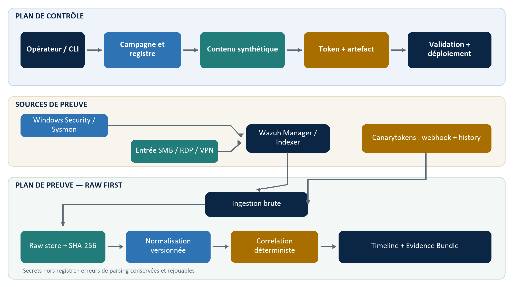

# JANUS — Cahier des charges de redémarrage et architecture cible

**Version :** 1.0  
**Date :** 4 août 2026  
**Statut :** proposition à valider avant toute implémentation  
**Projet :** Honey-Documents Dynamiques assistés par l’IA — JANUS  
**Base d’analyse :** archive `JANUS-HANDOFF-2026-08-04.zip`, avec revue prioritaire de `legacy/HoneyDocJANUS`

> **Décision proposée.** JANUS doit devenir un système de preuve de cyberdéception, et non une plateforme de génération de documents à laquelle on ajoute de la télémétrie. Le premier jalon doit démontrer un seul scénario vertical sur deux machines Windows, avec un DOCX unique, Wazuh et un Canarytoken officiel. L’IA, le multi-format et le tableau de bord ne reviennent qu’après la preuve de bout en bout.

## 1. Objet du cahier des charges

Ce document fixe les objectifs, le périmètre, les exigences, l’architecture cible, les règles de preuve, les critères d’acceptation et le plan de réalisation d’un nouveau JANUS. Il sert de référence commune avant tout code.

Le projet cherche à détecter l’interaction avec un fichier leurre crédible et à recueillir le maximum d’informations **réellement observées et défendables** sur cette interaction. Il ne cherche pas à identifier magiquement une personne ni à reconstruire une attaque complète sans capteurs adaptés.

Les principes directeurs sont les suivants :

- chaque valeur affichée est reliée à un événement source conservé ;
- une absence de donnée reste `null` avec une raison, jamais une valeur plausible ;
- les observations, enrichissements et inférences sont séparés ;
- un événement brut est enregistré avant d’être parsé ou corrélé ;
- une proximité temporelle seule ne fusionne jamais automatiquement deux événements ;
- les protections Office ne sont pas affaiblies et aucune macro n’est utilisée ;
- l’IA produit du contenu synthétique crédible, jamais une preuve de sécurité ;
- chaque capacité annoncée possède un test reproductible et une preuve archivée.

## 2. Avis critique sur le projet et l’héritage

### 2.1 Conclusion de la revue

L’idée est pertinente pour un projet universitaire : elle permet de travailler simultanément la cyberdéception, la télémétrie endpoint, la qualité des preuves, la corrélation et l’explicabilité. La difficulté n’est pas de fabriquer beaucoup de leurres ; elle est de ne pas surinterpréter les signaux reçus.

Le prototype historique contient de vraies briques utiles et une suite locale cohérente : le rerun effectué lors de cette revue a produit **76 tests réussis et 7 sous-tests réussis**. Les preuves archivées montrent également un événement Windows 4663 réel, une alerte Wazuh `100100/100101`, une SACL active et un collecteur en fonctionnement. Ces résultats valident des mécanismes isolés, pas encore une chaîne complète d’attribution à un acteur.

La reconstruction doit donc préserver les connaissances, les fixtures et les procédures, mais repartir sur un modèle de données et un flux de preuve neufs.

### 2.2 Ce qui est conservé comme référence

| Élément de `legacy` | Décision | Justification |
|---|---|---|
| Fixture Wazuh 4663 anonymisée | Conserver | C’est une preuve réaliste pour les tests de normalisation. |
| Scripts SACL et diagnostic 4663 | Adapter | Ils ont produit une preuve réelle, mais doivent devenir portables, réversibles et idempotents. |
| Contrôle de la racine de déploiement | Reprendre le principe | Le refus des chemins extérieurs et la copie atomique sont des bases saines. |
| SHA-256 de l’artefact déployé | Conserver | Il relie une instance du leurre au fichier effectivement déposé. |
| Curseur, chevauchement et déduplication Wazuh | Redessiner puis reprendre | Le mécanisme est utile, mais le brut doit être persisté avant le parsing et avant l’avancement du curseur. |
| Adaptateurs Windows, Sysmon et auditd | Utiliser comme cas de test | Les champs déjà étudiés sont utiles ; le nouveau modèle doit éviter les doubles modèles métier. |
| Générateur de classeur comptable | Reporter puis reprendre | Bonne brique de crédibilité, non nécessaire au premier jalon. |
| Corpus finance/RH/technique | Réutiliser après assainissement | Il aide la génération de contenu synthétique, mais ne doit contenir aucune donnée réelle. |
| Tests négatifs de chemins et API | Reprendre | Ils couvrent des risques concrets. |

### 2.3 Ce qui doit être remplacé ou abandonné

| Élément historique | Décision | Motif |
|---|---|---|
| Monolithe FastAPI + dashboard + rotation + faux HTTP/SSH | Abandonner dans le cœur | Trop de responsabilités et trop de défaillances possibles pour une démonstration de preuve. |
| Repli silencieux d’un Canarytoken distant vers un pixel local | Interdire | Deux mécanismes différents ne doivent jamais porter le même nom ni le même niveau de garantie. |
| Webhook Canary accepté sur le seul `token_id` | Remplacer | Un callback non authentifié est forgeable ; il doit être marqué non vérifié puis réconcilié avec l’historique du fournisseur, ou authentifié si le fournisseur le permet. |
| Stockage de `auth_token` en clair dans la base opérationnelle | Interdire | Le registre doit stocker une référence de secret, pas le secret lui-même. |
| Score de risque `40 + 30 + 30` | Retirer du MVP | Il donne une précision numérique non calibrée et mélange preuve, anomalie et sévérité. |
| Deux modèles concurrents `SecurityEvent` et `SecuritySignal` | Remplacer | Un modèle canonique unique est nécessaire pour la traçabilité et les relectures. |
| `confidence=direct/high/medium/low` sur un même axe | Remplacer | La nature de la donnée et la force d’une conclusion sont deux dimensions différentes. |
| Stockage SQLite qualifié d’« immuable » sans protection | Corriger | SQLite peut être rendu append-only au niveau applicatif, mais ne constitue pas une preuve inviolable. |
| Avancement du curseur après rejet de parsing | Interdire | Un changement de schéma Wazuh peut sinon provoquer une perte silencieuse. |
| Association « même leurre = même acteur » | Interdire | Deux personnes peuvent toucher le même fichier ; le lien au leurre ne prouve pas l’identité de session. |
| Déduction d’OS à partir du User-Agent comme fait | Interdire | Un User-Agent est une déclaration falsifiable et peut être absent. |

### 2.4 Amélioration centrale

Le nouveau flux doit être **raw-first** :

1. recevoir ou lire l’événement ;
2. enregistrer son payload exact, son empreinte et son heure de réception ;
3. seulement ensuite normaliser ;
4. conserver les erreurs de normalisation dans une file de rejet ;
5. corréler des événements normalisés sans modifier les événements bruts ;
6. produire des affirmations qui référencent explicitement leurs preuves.

Cette règle évite qu’une modification du schéma Wazuh, une valeur inattendue ou un parseur incomplet fasse disparaître un événement.

## 3. Vision et objectifs

### 3.1 Vision produit

JANUS est un laboratoire de cyberdéception qui permet à un opérateur de créer et déployer un leurre, puis d’obtenir une chronologie expliquant :

- quel leurre a été concerné ;
- ce que l’hôte surveillé a observé ;
- ce qu’un service externe a observé ;
- quelles relations entre événements sont prouvées ;
- quelles relations ne sont que candidates ;
- quelles informations restent inconnues.

### 3.2 Objectifs obligatoires

1. Générer ou préparer un artefact crédible, unique, synthétique et sans macro.
2. Associer chaque exemplaire à un identifiant JANUS, un SHA-256 et, lorsque le format le permet, un token officiel unique.
3. Déployer le leurre dans une racine autorisée et instrumentée.
4. Collecter les événements endpoint et d’entrée pertinents via Wazuh.
5. Collecter ou relire les déclenchements Canarytokens sans inventer de champs absents.
6. Conserver les événements bruts avant leur traitement.
7. Normaliser les sources sans perte et avec version de schéma.
8. Corréler uniquement avec des clés et des fenêtres défendables.
9. Produire une chronologie lisible avec provenance, catégorie, force et limites.
10. Mesurer la couverture et les faux positifs par application et par scénario.

### 3.3 Objectifs de recherche différés

- enrichissement d’IP par ASN, RDAP, pays approximatif et listes Tor ;
- Sysmon pour la lignée de processus, le réseau, DNS et les créations de fichiers ;
- Linux auditd ;
- formats XLSX, PDF et faux secrets ;
- Canarytokens auto-hébergé ;
- capteur réseau ou journaux de proxy/pare-feu ;
- assistance IA à l’explication, uniquement à partir de faits déjà structurés ;
- évaluation de tokens récents, par exemple un leurre de configuration MCP, dans un lot de recherche séparé.

### 3.4 Non-objectifs

JANUS ne garantit pas :

- l’identité civile de l’acteur ;
- son adresse MAC distante ;
- son IP privée derrière un NAT, un VPN, un proxy ou un résolveur ;
- son système d’exploitation exact à partir d’un User-Agent ;
- sa localisation physique exacte ;
- l’exfiltration complète d’un fichier à partir d’un seul accès en lecture ;
- l’équivalence entre ouverture, aperçu, indexation, copie et lecture complète ;
- le hack-back, l’exécution de code dans le document ou la désactivation des protections Office ;
- un SOC de production, la haute disponibilité ou le machine learning au premier jalon.

## 4. Hypothèses de cadrage proposées

Le cahier des charges retient les hypothèses suivantes pour éviter un périmètre indéterminé :

- un laboratoire isolé avec un Wazuh Manager/Indexer existant ;
- une machine Windows surveillée qui héberge un partage SMB de démonstration ;
- une seconde machine Windows jouant le rôle de poste d’interaction ;
- synchronisation horaire des machines ;
- un seul format MVP : DOCX ;
- un Canarytoken Word officiel sur le service public pour le premier cycle ;
- une interface en ligne de commande et un rapport d’évidence, sans dashboard complet ;
- aucun LLM requis pour prouver le flux ; un gabarit synthétique suffit au début ;
- données exclusivement fictives et laboratoire autorisé.

Si une de ces hypothèses n’est pas acceptable, elle doit être modifiée dans le journal de décisions avant l’implémentation.

## 5. Modèle de menace

### 5.1 Acteurs

- **Opérateur JANUS :** crée, valide, déploie et retire les leurres.
- **Analyste :** consulte les observations et les preuves.
- **Acteur simulé :** accède au leurre depuis une machine locale ou distante autorisée dans le laboratoire.
- **Services techniques :** Windows, Wazuh, Canarytokens, éventuel fournisseur d’enrichissement.
- **Bruit légitime :** antivirus, indexeur, sauvegarde, outil de prévisualisation, administrateur et processus de déploiement.

### 5.2 Scénarios à traiter séparément

**S1 — accès via partage SMB.** Un poste distant parcourt le partage, lit ou copie le DOCX. C’est le scénario MVP, car il peut fournir le compte, le Logon ID, le chemin, l’IP source et les droits demandés au moyen de plusieurs événements liés.

**S2 — interaction locale sur l’hôte surveillé.** Un acteur déjà présent sur la machine ouvre, copie, modifie ou supprime le fichier. Wazuh décrit l’hôte, le compte, le processus et l’accès, mais ne fournit pas nécessairement un point d’entrée réseau.

**S3 — copie puis ouverture hors du périmètre.** Le fichier quitte l’hôte et déclenche son token ailleurs. Le contact externe est prouvé ; la copie, la personne et la machine distante ne le sont pas automatiquement.

**S4 — protections ou analyse statique.** Le client bloque les ressources externes ou inspecte le fichier sans les charger. Le token peut rester silencieux ; l’accès endpoint peut néanmoins être observé.

**S5 — déclenchement automatique.** Un antivirus, un indexeur, une passerelle ou un sandbox ouvre le fichier. Le système doit enregistrer l’événement sans l’étiqueter automatiquement comme humain ou malveillant.

## 6. Informations à recueillir et contrat de vérité

### 6.1 Catégories obligatoires

Chaque champ exposé porte l’une des catégories suivantes :

- **observé :** valeur contenue directement dans un événement source ;
- **enrichi :** résultat externe calculé à partir d’une valeur observée, avec fournisseur et date ;
- **inféré :** affirmation calculée par une règle versionnée, avec preuves et limites ;
- **non observé :** valeur absente avec un code de raison.

La force d’une affirmation est séparée de sa catégorie :

- **confirmé :** une source directe suffit à l’affirmation exacte ;
- **corroboré :** au moins deux preuves compatibles partagent une clé forte ;
- **candidat :** les preuves sont compatibles mais ne suffisent pas à conclure ;
- **non soutenu :** la règle interdit l’affirmation.

Enfin, la confiance dans le transport de la source est explicitée : `verified`, `unverified` ou `invalid`. Exemple : un événement relu par l’API Wazuh avec TLS vérifié est `verified`; un webhook sans signature reconnue reste `unverified` jusqu’à réconciliation.

### 6.2 Matrice des données

| Donnée | Source admissible | Catégorie | Limite obligatoire |
|---|---|---|---|
| Date d’interaction | horodatage source + réception JANUS | Observé | conserver les deux horloges et l’écart estimé |
| Leurre concerné | token exact ou déploiement hôte+chemin | Observé/corrélé | le hash seul ne prouve pas l’endroit de l’accès |
| Hôte surveillé | `computer` Windows ou nom d’agent | Observé | décrit le capteur, pas forcément l’hôte de l’acteur distant |
| Compte/SID | 4663, 4624, 5145, auditd | Observé | compte compromis possible ; pas une identité civile |
| Logon ID | événements Windows compatibles | Observé | réutilisation possible après redémarrage ; borner la session |
| Action fichier | droits utilisés dans 4663/5145 | Observé puis qualifié | `ReadData` ne prouve pas un affichage complet ni une exfiltration |
| Processus/PID | 4663, 4688, Sysmon | Observé | le PID doit être borné par la durée de vie du processus |
| Commande | 4688/Sysmon 1 | Observé si présente | journalisation optionnelle et sensible ; peut être vide |
| Lignée et hash du processus | Sysmon 1 ou AppLocker adapté | Observé | hash de l’exécutable, pas identité de l’utilisateur |
| IP d’entrée | 4624/5145 ou journal du vrai service | Observé si présente | peut être proxy/NAT ; ne jamais utiliser `agent.ip` comme IP acteur |
| IP vue par le token | événement Canarytokens | Observé | egress, proxy, VPN ou résolveur possibles |
| User-Agent | canal HTTP du token | Observé | falsifiable et parfois absent |
| Pays/ASN/Tor | fournisseur d’enrichissement | Enrichi | décrit l’IP et la base consultée à une date donnée |
| OS de l’acteur | User-Agent ou autre indice | Inféré | au mieux candidat ; inconnu par défaut |
| Copie puis ouverture ailleurs | accès endpoint + hit du même leurre | Inféré | même leurre ne signifie pas même acteur |
| Point d’entrée | 4624/5145/RDP/SSH/VPN réels | Observé/corroboré | aucune valeur si le journal du service manque |

## 7. Options d’architecture

### 7.1 Option A — démonstrateur endpoint-first

Un outil en ligne de commande crée un DOCX officiel, l’enregistre, le déploie et interroge Wazuh et l’historique Canarytokens.

**Avantages :** petit, compréhensible, rapide à démontrer.  
**Limites :** stockage et rejouabilité modestes, évolution difficile vers plusieurs capteurs.  
**Usage recommandé :** premier jalon technique, pas architecture finale.

### 7.2 Option B — Evidence Hub à deux plans

Le plan de contrôle gère campagnes, contenu, token, validation et déploiement. Le plan de preuve ingère d’abord le brut, puis normalise, corrèle et produit la chronologie. Les secrets sont séparés du registre.

**Avantages :** preuve traçable, rejouabilité, capteurs remplaçables, séparation claire entre production du leurre et observation.  
**Limites :** davantage de contrats et de tests à écrire.  
**Usage recommandé :** architecture cible, construite par incréments à partir de l’option A.

### 7.3 Option C — plateforme de recherche auto-hébergée

L’option B est complétée par Canarytokens auto-hébergé, reverse proxy, DNS contrôlé, journaux HTTP complets et éventuellement capteur réseau.

**Avantages :** maîtrise de la rétention et télémétrie réseau plus riche.  
**Limites :** DNS, HTTPS, exposition Internet, anti-abus, sauvegardes, patching et conformité deviennent un projet à part entière.  
**Usage recommandé :** lot de recherche final uniquement.

### 7.4 Choix retenu

L’**option B** est retenue comme architecture cible. Le premier incrément implémente le minimum de l’option A, mais chaque fichier et chaque table respectent déjà les frontières de l’option B. L’option C reste hors MVP.

## 8. Architecture cible

### 8.1 Vue d’ensemble

Le flux de preuve est indépendant du flux de génération. Une panne du LLM ne doit pas arrêter la collecte, et un changement de rendu de document ne doit pas modifier les règles de confiance.

### 8.2 Composants

**Campaign CLI.** Crée une campagne et orchestre des opérations explicites. Il ne démarre pas automatiquement un dashboard, un honeypot réseau ou une rotation.

**Content Generator.** Produit une structure validée à partir d’un gabarit ou d’un LLM. Le mode de génération, le modèle et les contraintes sont enregistrés. Aucune télémétrie réelle ni donnée personnelle n’est envoyée au LLM.

**Artifact Builder.** Produit ou transforme un artefact en suivant le mécanisme officiel du type de token. Le rendu riche et le mécanisme de détection restent deux responsabilités distinctes.

**Artifact Validator.** Vérifie le conteneur, l’absence de macro, le mécanisme distant attendu, l’ouverture sans réparation, le SHA-256 et, dans un test contrôlé, le déclenchement réel.

**Token Provider Adapter.** Encapsule la création, le téléchargement, l’historique et la révocation. Il ne transforme pas une erreur distante en token local silencieux.

**Secret Store.** Conserve les secrets de gestion hors du registre. Le registre ne stocke qu’un `secret_ref`. Pour le laboratoire, un gestionnaire de secrets du système ou un magasin chiffré et protégé par ACL est requis.

**Deployment Adapter.** Copie atomiquement vers une racine autorisée, applique ou vérifie l’instrumentation, puis enregistre la preuve de déploiement. Les événements produits par JANUS sont reliés à un `deployment_run_id`, pas supprimés par une simple hypothèse de délai.

**Registry.** Conserve les campagnes, leurres, artefacts, tokens référencés, déploiements, capteurs attendus et états. Il est modifiable et ne doit pas être confondu avec le stockage brut.

**Raw Ingest.** Enregistre les payloads Wazuh, Canarytokens et journaux d’entrée avant tout parsing. Chaque enregistrement contient un hash, une heure de réception, une source, un identifiant fournisseur et un statut de transport.

**Normalizer.** Produit un événement canonique versionné. Une erreur crée un `normalization_failure` réexécutable ; elle ne supprime jamais le brut.

**Correlation Engine.** Applique des règles déterministes versionnées. Il manipule un ensemble de clés typées, pas un champ `strong_key` unique.

**Evidence Timeline.** Affiche faits, enrichissements, affirmations, sources, limites et liens vers les payloads. Le premier livrable est une sortie CLI/JSON et un rapport exportable.

### 8.3 Ordre garanti du pipeline

1. Réception de l’événement.
2. Canonicalisation minimale uniquement pour calculer l’empreinte.
3. Écriture du brut.
4. Accusé d’ingestion.
5. Normalisation asynchrone ou rejouable.
6. Corrélation.
7. Production d’observations et d’affirmations.
8. Enrichissement facultatif.
9. Présentation et export.

Le curseur d’un collecteur ne peut avancer au-delà d’un événement que lorsque le brut correspondant est persisté ou explicitement enregistré comme doublon.

## 9. Modèle de données cible

### 9.1 Entités minimales

| Entité | Rôle | Champs essentiels |
|---|---|---|
| `Campaign` | groupe une expérience | id, nom, objectif, état, dates |
| `DecoyTemplate` | contenu synthétique validé | type, version, source, contraintes |
| `DecoyArtifact` | fichier avant/après tokenisation | id, format, sha256, validation_status, macro_status |
| `TokenReference` | lien vers le fournisseur | provider, token_public_id, secret_ref, type, état |
| `Deployment` | instance déposée | artifact_id, host_id, chemin, share, deployed_at, run_id |
| `RawEvent` | payload reçu sans perte | source, source_event_id, received_at, source_time, sha256, payload, transport_trust |
| `NormalizedEvent` | vue canonique versionnée | schema_version, event_type, subject, object, process, network, correlation_keys |
| `Claim` | affirmation calculée | rule_id/version, statement, strength, evidence_ids, limitations |
| `Enrichment` | résultat externe | provider, input, queried_at, raw_response_hash, output |
| `EvidenceBundle` | export reproductible | campagne, événements, claims, manifest, hashes |

### 9.2 Clés de corrélation typées

Chaque événement normalisé peut porter zéro à plusieurs clés :

- `decoy_token:<provider>:<token_id>` ;
- `deployment:<deployment_id>` ;
- `file_path:<host_id>:<normalized_path>` ;
- `file_hash:sha256:<hash>` ;
- `windows_session:<host_id>:<boot_id>:<logon_id>` ;
- `process_guid:<host_id>:<guid>` ;
- `process_lifetime:<host_id>:<pid>:<start_time>` ;
- `smb_object:<host_id>:<logon_id>:<share>:<relative_path>` ;
- `source_event:<source>:<event_id>`.

La valeur originale reste disponible ; la valeur normalisée est utilisée pour les comparaisons. Les PID hexadécimaux et décimaux sont normalisés sans perdre leur représentation source.

### 9.3 Règles de corrélation initiales

| Règle | Résultat autorisé | Force | Interdiction associée |
|---|---|---|---|
| C01 token exact → `TokenReference` → `DecoyArtifact` | contact du mécanisme de ce leurre | Confirmé | ne pas conclure à l’identité de l’acteur |
| C02 hôte + chemin exact → `Deployment` actif | accès à l’instance déployée | Confirmé | ne pas associer un fichier ordinaire du même dossier |
| C03 5145 + 4663, même hôte/logon/objet, fenêtre bornée | accès SMB corroboré | Corroboré | ne pas utiliser une IP d’événement voisin sans Logon ID commun |
| C04 4624 + 5145/4663, même hôte/logon et session bornée | point d’entrée/session candidate ou corroborée | Corroboré | exclure types de logon non pertinents et adresses absentes |
| C05 4663 PID + 4688/Sysmon 1, même hôte et durée de vie | processus ayant accédé au fichier | Corroboré | ne pas corréler un PID réutilisé ni exiger une proximité de quelques secondes |
| C06 événement endpoint puis hit externe du même leurre | ouverture externe après accès local possible | Candidat | ne pas conclure « même acteur » ni « exfiltration prouvée » |
| C07 proximité temporelle sans clé commune | coïncidence affichée séparément | Non soutenu | aucune fusion automatique |

### 9.4 Stockage brut

Pour le laboratoire, SQLite reste acceptable si :

- `raw_events` est séparé du registre opérationnel ;
- l’application n’expose que l’insertion et la lecture ;
- des déclencheurs refusent `UPDATE` et `DELETE` sur les tables brutes ;
- chaque payload possède un SHA-256 calculé sur une représentation canonique documentée ;
- les exports contiennent un manifeste de hashes ;
- les sauvegardes sont testées.

Cette protection améliore la reproductibilité, mais ne doit pas être présentée comme une conservation forensique inviolable. Une version avancée pourra utiliser un stockage objet avec rétention/WORM.

## 10. Exigences fonctionnelles

| ID | Priorité | Exigence | Critère de preuve |
|---|---|---|---|
| F-01 | Must | Créer une campagne et un identifiant unique de leurre | sortie CLI + enregistrement du registre |
| F-02 | Must | Produire un contenu synthétique structuré sans donnée réelle | validation de schéma + test de corpus interdit |
| F-03 | Must | Obtenir un artefact DOCX à token officiel unique | réponse fournisseur, fichier téléchargé, token unique |
| F-04 | Must | Refuser un artefact corrompu, avec macro ou mécanisme absent | tests OOXML et ouverture sans réparation |
| F-05 | Must | Calculer et enregistrer le SHA-256 avant déploiement | hash identique lors de la vérification post-copie |
| F-06 | Must | Déployer uniquement sous une racine autorisée | tests chemin valide, frère et traversée |
| F-07 | Must | Vérifier SACL et collecte Windows avant activation | diagnostic automatisé et événement de contrôle |
| F-08 | Must | Ingest Wazuh brut avant parsing | test avec payload inconnu conservé puis rejet normalisation |
| F-09 | Must | Ingest événement Canary brut avec statut de transport | payload, hash, heure de réception, `verified/unverified` |
| F-10 | Must | Réconcilier un webhook non signé avec l’historique fournisseur lorsque possible | passage `unverified` → `verified` ou conservation de la limite |
| F-11 | Must | Normaliser 4624, 4663 et 5145 | fixtures positives/négatives versionnées |
| F-12 | Must | Corréler par chemin, Logon ID, partage et session | règles C02 à C04 avec contre-exemples |
| F-13 | Must | Dédupliquer sans perdre le brut | replay identique, un événement source logique |
| F-14 | Must | Exposer `null + reason` pour toute donnée absente | tests de contrat de vérité |
| F-15 | Must | Produire une timeline JSON et lisible | chaque claim référence ses preuves |
| F-16 | Must | Exporter un Evidence Bundle | archive, manifeste, hashes, versions de règles |
| F-17 | Should | Normaliser 4688 et relier un processus par durée de vie | test PID réutilisé et processus long-vivant |
| F-18 | Should | Ajouter Sysmon 1/3/11/22 | preuves distinctes processus/réseau/fichier/DNS |
| F-19 | Should | Mesurer DOCX sur plusieurs clients et modes de protection | matrice de couverture signée par date/version |
| F-20 | Could | Ajouter XLSX et PDF après le gel DOCX | même gate de validation et matrice indépendante |

## 11. Exigences non fonctionnelles

### 11.1 Fiabilité et intégrité

- 100 % des événements acceptés par un connecteur sont persistés bruts avant normalisation.
- Aucun échec de parsing ne fait avancer silencieusement le curseur sans trace.
- Le replay des mêmes événements avec les mêmes versions de règles produit les mêmes résultats.
- Un redémarrage ne crée ni perte ni doublon logique.
- Les temps source et réception sont conservés ; la synchronisation NTP du laboratoire est contrôlée.
- La latence cible d’apparition dans la timeline est inférieure à 60 secondes dans le laboratoire, sans en faire une garantie universelle.

### 11.2 Sécurité

- API administrative absente du MVP ou liée à loopback avec authentification obligatoire.
- TLS Wazuh vérifié ; aucun `verify=False` par défaut.
- Secrets exclus des logs, exports et objets publics.
- Entrées bornées en taille ; JSON, ZIP, XML et chemins traités défensivement.
- Aucun secret réel, honeypot pivotable, macro ou code actif dans les leurres.
- Les lignes de commande 4688, si activées, sont considérées sensibles et soumises à contrôle d’accès et rétention courte.
- Les événements externes sont validés, réconciliés ou explicitement étiquetés non vérifiés.

### 11.3 Explicabilité

- Une affirmation n’existe que si elle possède `rule_id`, `rule_version`, `evidence_ids`, `strength` et `limitations`.
- L’interface ne montre jamais un score opaque comme substitut de preuve.
- Le terme « attaquant » est réservé au scénario ; les données parlent d’« acteur observé », de compte, de session ou de client demandeur.

### 11.4 Confidentialité et éthique

- Finalité limitée au laboratoire Blue Team autorisé.
- Données personnelles minimisées et accès restreint.
- Politique de rétention proposée : brut 30 jours dans le laboratoire, exports anonymisés conservés pour le rapport ; toute autre durée doit être validée.
- Aucun document interne réel n’est envoyé au LLM.
- Les rapports publics anonymisent IP, comptes, noms de machines, tokens et chemins personnels.

### 11.5 Maintenabilité

- Un module par responsabilité, avec dépendances dirigées vers le domaine.
- Schémas et règles versionnés.
- Connecteurs Wazuh et Canary remplaçables par interfaces.
- Configuration validée au démarrage ; aucun repli silencieux.
- Chaque lot comporte une note pédagogique, les fichiers modifiés, les commandes et les preuves de test.

## 12. Scénario vertical minimal

### 12.1 But

Démontrer qu’un accès distant contrôlé à un DOCX déployé sur un partage SMB produit une chaîne de preuves fiable, tout en mesurant indépendamment le déclenchement Canarytokens.

### 12.2 Préconditions

- Wazuh Manager/Indexer fonctionnel.
- Agent Wazuh sur le serveur Windows.
- Audit Windows activé pour 4624, 4663 et 5145.
- SACL ciblée uniquement sur la racine de leurres.
- Partage SMB de laboratoire et compte de test dédié.
- Deuxième machine Windows avec Word, réseau et heure synchronisée.
- DOCX officiel validé, token unique, hash et déploiement enregistrés.

### 12.3 Déroulement

1. Créer la campagne et le leurre.
2. Vérifier que l’historique du token est vide ou archiver son état initial.
3. Déployer le DOCX et enregistrer les événements légitimes du déploiement avec leur `deployment_run_id`.
4. Depuis le poste d’interaction, ouvrir une nouvelle session SMB puis parcourir, copier et ouvrir le DOCX selon un script de test documenté.
5. Collecter 4624, 5145 et 4663 ; persister chaque payload avant normalisation.
6. Corréler hôte + Logon ID + partage/chemin.
7. Vérifier l’historique Canarytokens. Si le client bloque la ressource, enregistrer honnêtement `no_token_contact_observed`.
8. Exporter la timeline et le bundle de preuves.

### 12.4 Résultat attendu

La timeline doit pouvoir affirmer :

- un compte Windows précis a utilisé une session donnée sur l’hôte surveillé ;
- une IP source a été observée par 4624/5145 si le champ est réellement présent ;
- le fichier déployé exact a subi un droit d’accès précis ;
- les événements partagent un Logon ID et un objet compatibles ;
- le mécanisme Canary du même leurre a ou n’a pas contacté le fournisseur ;
- aucune conclusion sur l’identité civile, l’OS exact ou l’exfiltration n’est ajoutée sans preuve.

## 13. Plan de tests et critères d’acceptation

### 13.1 Matrice minimale

| Famille | Cas positif | Cas négatif/limite |
|---|---|---|
| Déploiement | copie sous racine, hash identique | traversée, racine sœur, fichier déjà modifié |
| Audit | lecture contrôlée produit 4663 | fichier hors racine ne devient pas un leurre JANUS |
| SMB | 4624/5145/4663 même session | événements simultanés de deux comptes non fusionnés |
| Processus | PID lié dans sa durée de vie | PID réutilisé après fin/redémarrage |
| Canary | hit réel visible dans history | contenu externe bloqué, réseau coupé, aperçu |
| Webhook | événement réconcilié | callback forgé ou token inconnu |
| Normalisation | payload connu → événement canonique | champ absent ou nouveau → brut conservé + rejet |
| Déduplication | polling répété sans doublon logique | deux payloads distincts avec même minute conservés |
| Bruit | processus de test identifié | antivirus, indexeur, sauvegarde, miniature |
| Reprise | arrêt/redémarrage sans perte | panne après écriture brute avant normalisation |
| Confidentialité | export anonymisé | secret/token/auth absent du bundle public |

### 13.2 Conditions d’acceptation du MVP

Le MVP est accepté uniquement si :

- au moins trois exécutions complètes du scénario donnent un résultat reproductible ;
- le brut de chaque source est exportable et vérifiable par hash ;
- aucune donnée manquante n’est remplacée ;
- un payload Wazuh volontairement non supporté est conservé et rejouable ;
- deux sessions concurrentes ne sont pas fusionnées ;
- le faux positif du processus de déploiement est expliqué par un identifiant d’exécution ;
- un webhook forgé n’est jamais présenté comme événement vérifié ;
- la matrice Word documente ouverture normale, Protected View, contenu externe bloqué, aperçu, Internet coupé et ouverture après copie ;
- le rapport final distingue clairement preuve endpoint et preuve token.

### 13.3 Indicateurs

- taux d’ingestion brute ;
- taux de normalisation et nombre de rejets ;
- précision de corrélation sur le jeu contrôlé ;
- taux de déclenchement par application/mode ;
- latence source → timeline ;
- doublons après replay ;
- champs non observés par scénario ;
- faux positifs expliqués par catégorie de bruit.

Le « taux de détection » n’est publié qu’avec le nombre d’essais, les versions des applications et les paramètres de sécurité.

## 14. Plan de réalisation

### Lot 0 — gel de la conception

Livrables : cahier des charges validé, modèle de menace, décisions de laboratoire, critères d’acceptation.  
Gate : aucune implémentation métier avant validation.

### Lot 1 — laboratoire et preuve Windows

Livrables : script d’audit réversible, SACL ciblée, 4624/4663/5145 réels, export Wazuh brut.  
Gate : preuve répétée depuis la deuxième machine.

### Lot 2 — artefact DOCX et token

Livrables : artefact officiel, validation OOXML, absence de macro, SHA-256, matrice Word.  
Gate : comportement réel documenté, y compris les non-déclenchements.

### Lot 3 — registre, secrets et déploiement

Livrables : modèles minimaux, secret reference, copie atomique, `deployment_run_id`.  
Gate : tests de chemin et preuve post-copie.

### Lot 4 — ingestion raw-first

Livrables : connecteurs Wazuh/Canary, raw store append-only applicatif, déduplication, file de rejet.  
Gate : test de panne et replay sans perte.

### Lot 5 — normalisation et corrélation

Livrables : schéma canonique, règles C01 à C07, exemples positifs/négatifs.  
Gate : deux sessions simultanées correctement séparées.

### Lot 6 — timeline et dossier de preuve

Livrables : CLI, export JSON, Evidence Bundle, rapport de démonstration.  
Gate : trois exécutions reproductibles.

### Lot 7 — extensions de recherche

Sysmon, enrichissement IP, XLSX/PDF, Linux, auto-hébergement et UI ne commencent qu’après acceptation du lot 6.

Estimation indicative : 20 à 30 jours-étudiant pour les lots 0 à 6, hors installation initiale de l’infrastructure et délais d’accès aux machines. Chaque lot doit rester démontrable indépendamment.

## 15. Livrables attendus

- cahier des charges et journal de décisions ;
- schémas de données versionnés ;
- code source par composants ;
- scripts d’installation, diagnostic et retour arrière ;
- configurations Wazuh et règles personnalisées ;
- corpus synthétique documenté ;
- matrices de tests par format et client ;
- fixtures brutes anonymisées ;
- Evidence Bundles de démonstration ;
- guide d’exploitation du laboratoire ;
- rapport final exposant résultats, limites et travaux futurs.

## 16. Risques et mesures

| Risque | Impact | Mesure |
|---|---|---|
| Token bloqué par le client | absence de signal externe | mesurer par client ; Wazuh reste un canal indépendant |
| Faux hit par scanner | attribution erronée | catégorie « automatisation candidate », jamais humain par défaut |
| Schéma Wazuh changeant | perte de collecte | raw-first, rejets rejouables, contrats versionnés |
| Confusion `agent.ip` / IP acteur | fausse attribution | règle de validation et tests dédiés |
| Réutilisation PID/Logon ID | mauvaise fusion | boot/session/lifetime et fenêtres bornées |
| Webhook forgé | fausse alerte | statut non vérifié, secret si supporté, réconciliation history |
| Secrets dans SQLite/logs | compromission | secret store, références, filtres et tests de fuite |
| LLM hallucine une preuve | conclusion fausse | LLM hors chemin de preuve, sorties structurées et contrôlées |
| Explosion du périmètre | projet incompréhensible | gates de lots et DOCX unique jusqu’au lot 6 |
| Collecte de données personnelles | risque juridique | minimisation, rétention, ACL et anonymisation |

## 17. Décisions à valider

Avant le lot 1, le propriétaire du projet valide ou modifie :

1. le scénario MVP SMB depuis une seconde machine ;
2. DOCX comme seul format initial ;
3. Canarytokens public pour le premier cycle ;
4. la possibilité d’activer 4624/4663/5145 et, plus tard, 4688 ;
5. la politique de rétention de 30 jours en laboratoire ;
6. l’absence de dashboard au MVP ;
7. l’usage d’un gabarit synthétique avant l’IA ;
8. la durée et les contraintes universitaires réelles.

## 18. Traçabilité de la revue

Éléments effectivement vérifiés lors de la préparation de ce cahier des charges :

- lecture intégrale du dossier de contexte de 1 399 lignes ;
- inventaire de l’archive et revue prioritaire de `legacy/HoneyDocJANUS` ;
- inspection des modules de collecte, stockage, normalisation, corrélation, API et génération ;
- inspection de la fixture Wazuh 4663 et des quatre captures brutes ;
- rerun local de la suite `legacy` : 76 tests et 7 sous-tests réussis ;
- vérification des limites et capacités dans les sources officielles Microsoft, Wazuh et Thinkst disponibles au 4 août 2026.

## 19. Sources techniques

- **[S1] Microsoft — Event 4663, accès à un objet :** https://learn.microsoft.com/en-us/previous-versions/windows/it-pro/windows-10/security/threat-protection/auditing/event-4663
- **[S2] Microsoft — Event 4688 et ligne de commande :** https://learn.microsoft.com/en-us/previous-versions/windows/it-pro/windows-10/security/threat-protection/auditing/event-4688
- **[S3] Microsoft — audit des processus de ligne de commande :** https://learn.microsoft.com/en-gb/windows-server/identity/ad-ds/manage/component-updates/command-line-process-auditing
- **[S4] Wazuh — collecte des Windows Event Channels :** https://documentation.wazuh.com/current/user-manual/capabilities/log-data-collection/configuration.html
- **[S5] Wazuh — règles personnalisées :** https://documentation.wazuh.com/current/user-manual/ruleset/rules/custom.html
- **[S6] Wazuh — File Integrity Monitoring et who-data :** https://documentation.wazuh.com/current/proof-of-concept-guide/poc-file-integrity-monitoring.html
- **[S7] Canarytokens — démarrage :** https://docs.canarytokens.org/guide/getting-started.html
- **[S8] Canarytokens — token Microsoft Word :** https://docs.canarytokens.org/guide/ms-word-token
- **[S9] Canarytokens — token Microsoft Excel :** https://docs.canarytokens.org/guide/ms-excel-token
- **[S10] Canarytokens — token Adobe PDF :** https://docs.canarytokens.org/guide/adobe-pdf-token
- **[S11] Thinkst — dépôt officiel et auto-hébergement :** https://github.com/thinkst/canarytokens et https://github.com/thinkst/canarytokens-docker
- **[S12] Canarytokens — token de configuration MCP, piste de recherche :** https://docs.canarytokens.org/guide/mcp-token

---

**Critère de départ du nouveau projet :** tant que les décisions de la section 17 ne sont pas validées, aucun composant métier ne doit être implémenté. Le premier code du nouveau JANUS doit servir le scénario vertical de la section 12 et rien d’autre.
