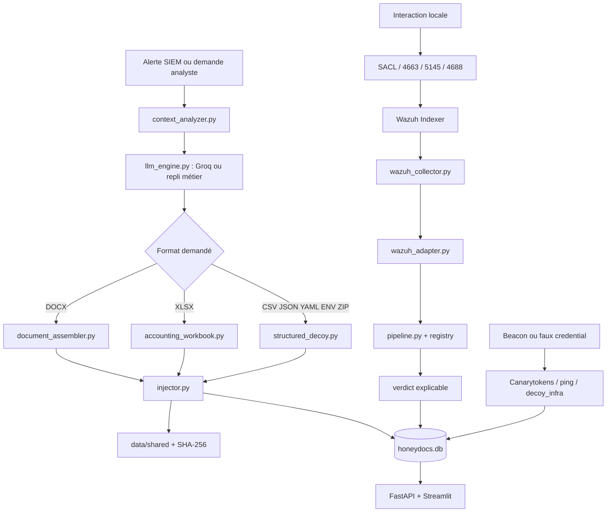

# État vérifiable du projet JANUS

Dernière revue technique : **3 août 2026**.

Ce document sépare ce qui est réellement exécuté de ce qui reste une dépendance
du laboratoire. Le terme « terminé » désigne ici un **MVP universitaire
reproductible**, pas une plateforme SOC de production.

## Résultat actuel

Le parcours local suivant est validé de bout en bout :

```text
requête API authentifiée
  -> génération d'un leurre
  -> déploiement atomique dans data/shared
  -> SHA-256 + enregistrement SQLite + token unique
  -> déclenchement du beacon ou utilisation du faux endpoint
  -> alertes normalisées et liées au même honeydoc
  -> consultation via API/dashboard
```

Le parcours Wazuh est couvert par des fixtures réelles anonymisées, des tests
d'intégration et la génération/validation XML. Le test contre les conteneurs
réels n'a pas été rejoué le 3 août, car Docker Desktop et l'API locale étaient
arrêtés au moment du contrôle.

## Architecture et flux



## Étapes, code, entrées et sorties

| Étape | Code principal | Entrée | Sortie vérifiable |
|---|---|---|---|
| Configuration | `src/core/config.py` | `.env` | objet `Settings`, chemins absolus |
| Préparation IA | `context_analyzer.py`, `llm_engine.py` | type, corpus, clé Groq facultative | texte métier ou repli local adapté |
| DOCX | `document_assembler.py` | texte, token, options CI1/CI3 | `.docx` sans macro |
| XLSX | `accounting_workbook.py`, `xlsx_canary.py` | synthèse, exercice, token | classeur comptable équilibré sans VBA |
| Formats structurés | `structured_decoy.py` | type, format, token | CSV/JSON/YAML/ENV/ZIP parseable |
| Déploiement | `lifecycle/injector.py` | artefact + cible autorisée | fichier atomique, SHA-256, ligne SQLite |
| Rotation | `rotation_manager.py` | leurres expirés | remplaçant créé avant désactivation |
| Audit Windows | scripts PowerShell | `data/shared` | SACL héritée et événement 4663 |
| Règles Wazuh | `configure_wazuh_rule.ps1` | chemin absolu du clone | règles 100100–100130 |
| Collecte | `wazuh_indexer_client.py`, collecteurs | JSON Wazuh | événements dédupliqués + curseurs |
| Normalisation | adaptateurs Windows/Linux | 4624/4663/4688/5145, Sysmon, auditd | `SecurityEvent` / `SecuritySignal` |
| Corrélation | `pipeline.py`, `sqlite_registry.py` | événement + registre actif | honeydoc reconnu ou événement ignoré |
| Télémétrie réseau | `canarytoken_handler.py`, `decoy_infra.py` | token connu ou connexion leurre | alerte liée, IP/UA avec provenance |
| Consultation | `alert_server.py`, `dashboard.py` | clé API | alertes, Wazuh, télémétrie, documents |

## Vérifications exécutées

### Automatiques

- 76 tests Pytest réussis ;
- 7 sous-tests réussis ;
- compilation Python complète réussie ;
- dépendances Python cohérentes (`pip check`) ;
- sept scripts PowerShell analysés sans erreur de syntaxe ;
- XML Wazuh valide avec neuf règles ;
- `docker compose config --quiet` réussi ;
- absence d'erreur `git diff --check`.

### Démarrage réel sur ports isolés

- `GET /health` : `ok`, version `2.0.0` ;
- route administrative sans clé : HTTP 401 ;
- route avec clé : HTTP 200 ;
- sept formats exposés ;
- faux HTTP : réponse reçue ;
- faux SSH : bannière `OpenSSH` reçue.

### Scénario cloud de bout en bout

1. génération d'un `.env` `cloud_credentials` ;
2. déploiement et SHA-256 de 64 caractères ;
3. déclenchement du beacon avec `curl` ;
4. utilisation du faux endpoint avec `python-requests` ;
5. deux alertes liées au même `honeydoc_id`.

## Corrections structurantes appliquées

- commande de lancement corrigée de `python src/main.py` vers `python main.py` ;
- commandes Docker corrigées et healthcheck ajouté ;
- routes administratives protégées par clé API ;
- callbacks inconnus rejetés au lieu de polluer SQLite ;
- taille des callbacks et limites de pagination bornées ;
- écritures SQLite configurées avec WAL, délai d'attente et clés étrangères ;
- déploiement atomique et noms concurrents rendus uniques ;
- rotation modifiée pour conserver l'ancien leurre si la régénération échoue ;
- faux HTTP corrélé au token et corps arbitraire non conservé en clair ;
- fallback LLM adapté aux thèmes finance, RH et technique/cloud ;
- dashboard complété pour les formats et l'état Wazuh ;
- sauvegardes `.env` et `backups/` exclues de Git.

## Qualité des informations sur l'acteur

| Information | Source fiable possible | Interprétation JANUS |
|---|---|---|
| hôte surveillé | agent Wazuh / événement Windows | directe |
| utilisateur | Windows/auditd | directe pour l'événement observé |
| processus et commande | 4688, Sysmon, auditd | directe si la politique les collecte |
| chemin et droit utilisé | 4663/5145 | directs |
| IP distante SMB/RDP | 5145/4624 | forte si Windows la fournit |
| IP Canarytoken | fournisseur | IP de sortie, pas forcément l'hôte |
| OS Wazuh | inventaire agent | fiable pour l'agent |
| OS du User-Agent | en-tête HTTP | faible, falsifiable |
| MAC distante | DHCP/NAC/ARP/EDR local | jamais déduite d'Internet |
| « téléchargement » | corrélation fichier + réseau/processus | inference, pas certitude sur 4663 seul |

## Dépendances non validables lorsque le laboratoire est arrêté

- arrivée d'un nouvel événement depuis le Wazuh Indexer réel ;
- production d'un 4663 par la SACL du clone final ;
- événement SMB 5145 depuis un second poste ;
- alertes Sysmon si Sysmon n'est pas installé ;
- appel public Canarytokens si le poste n'a pas Internet ou si le callback reste local ;
- commandes Linux si aucun agent Linux/auditd n'est actif.

Ces points disposent de scripts et de tests hors ligne, mais doivent être
rejoués dans l'environnement réel après démarrage.

## Limites restantes et évolutions honnêtes

Le MVP ne comprend pas encore :

- RBAC multi-utilisateur et gestion de campagnes complètes ;
- TLS/reverse proxy intégré ;
- serveur SSH complet comme Cowrie ;
- enrichissement DHCP/NAC/EDR ;
- haute disponibilité et stockage immuable ;
- déploiement automatique d'AD, SMB, Sysmon ou Wazuh ;
- pipeline CI GitHub exécuté par une organisation distante.

Ces éléments relèvent d'une phase d'industrialisation. Ils ne doivent pas être
présentés comme déjà livrés.

## Ordre recommandé pour notre revue pédagogique

1. lancer `main.py` et comprendre les processus démarrés ;
2. générer un fichier et suivre son enregistrement SQLite ;
3. lire le fichier généré et identifier chaque token ;
4. déclencher le beacon et le faux endpoint ;
5. revoir SACL, 4663 et les règles 100100–100104 ;
6. suivre une alerte Wazuh dans l'adaptateur, la corrélation et le verdict ;
7. étudier la télémétrie 4624/5145/4688/Sysmon/auditd ;
8. vérifier les limites et décider des prochaines extensions.
