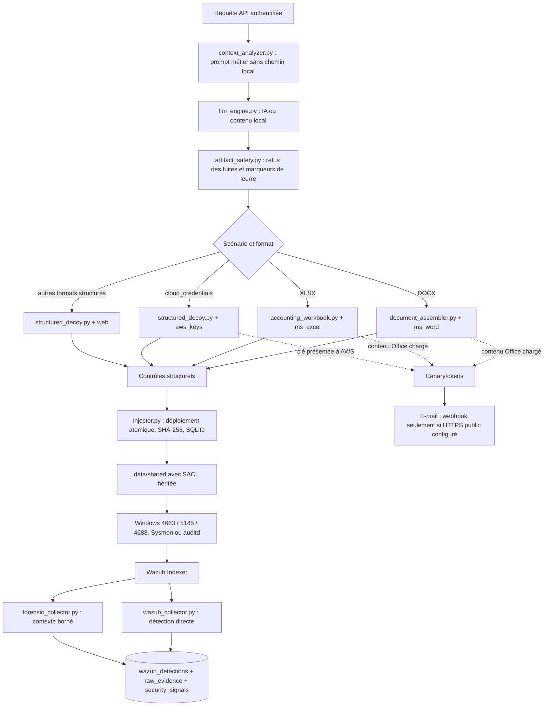

# État vérifiable du projet JANUS

Dernière revue technique : **10 août 2026**.

JANUS est un MVP universitaire Blue Team. Le cœur retenu est : génération de
HoneyDocs, déploiement surveillé, Wazuh pour les interactions sur les hôtes et
Canarytokens pour certains signaux hors de l'hôte. Les faux services SSH/HTTP et
les couches CI1/CI3 restent expérimentaux et désactivés.

## Parcours opérationnel

## État des composants

| Composant | État réel |
|---|---|
| Génération DOCX/XLSX/CSV/JSON/YAML/ENV/ZIP | opérationnelle, sans macro |
| Garde anti-divulgation | opérationnelle avant création du token |
| Déploiement sous `data/shared` | atomique, chemin borné, SHA-256 persisté |
| Canarytokens Office | `ms_word` et `ms_excel` officiels |
| Canarytokens cloud | `aws_keys` officiel pour ENV/YAML/JSON/ZIP |
| Échec fermé | bloque aussi un fournisseur non configuré |
| SACL + Wazuh | règles 100100–100104 actives sur le chemin du projet |
| Preuve brute | SHA-256 identique dans détection, brut et normalisé |
| Contexte Windows/Linux | opérationnel, borné à 3 jours/10 000 signaux par défaut |
| Rotation TTL | code présent, désactivée par défaut (`ROTATION_ENABLED=false`) |
| API administrative | protégée par `X-JANUS-API-Key` |
| Faux SSH/HTTP, CI1/CI3 | désactivés, hors du cœur du projet |

## Validation réelle du 4 août 2026

Un leurre `cloud_credentials` ENV a été généré comme HoneyDoc **ID 22** :

- fournisseur : `canarytokens` ;
- type : `aws_keys` ;
- activation déclarée : `aws_api_usage_email` ;
- fichier : `data/shared/cloud_migration_service_20260804213232_e831e9.env` ;
- aucune URL, aucun chemin local et aucun marqueur JANUS visible ;
- clé d'accès de 20 caractères et secret de 40 caractères présents sans être
  affichés dans les journaux de validation ;
- aucune utilisation des clés n'a été effectuée pendant le test.

Une lecture contrôlée a produit une alerte Wazuh règle **100101** :

- événement Windows 4663 ;
- action normalisée `read` ;
- chemin, compte et processus observés ;
- détection non supprimée ;
- même SHA-256 brut dans `wazuh_detections`, `raw_evidence` et
  `security_signals`.

Le nettoyage de contexte a été simulé sur une copie puis appliqué avec une
sauvegarde. La base est passée d'environ 452 Mo à 180 Mo. Les 62 détections
JANUS et la chaîne de preuve de l'ID 22 ont été conservées.

## Ce que les capteurs disent réellement sur l'acteur

| Donnée | Source | Qualité |
|---|---|---|
| compte, processus, action et chemin sur l'hôte surveillé | 4663/4688/auditd | directe pour l'événement |
| IP/port d'une session RDP/SMB | 4624/5145 si fournis | directe pour la connexion observée |
| point d'entrée | corrélation même hôte + même Logon ID | seulement si un 4624 compatible existe |
| IP d'un déclenchement Canarytoken | fournisseur | IP de sortie ; proxy/VPN possible |
| OS depuis User-Agent | en-tête HTTP | faible et falsifiable |
| MAC distante via Internet | aucune | indisponible, jamais inventée |
| téléchargement | plusieurs événements concordants | inférence ; 4663 seul reste `read` |

Wazuh voit les événements sur les machines où un agent et la stratégie d'audit
sont actifs. Un document copié puis ouvert sur une machine totalement externe
n'est plus visible par ce Wazuh. Canarytokens peut alors fournir un signal si le
beacon Office est chargé ou si une clé AWS est utilisée.

## Limites encore ouvertes

- Le webhook Canarytokens est désactivé tant qu'aucune URL HTTPS publique
  authentifiée n'est déployée ; les alertes actuelles arrivent par e-mail.
- La vérification TLS de l'Indexer est désactivée dans ce laboratoire local à
  cause du certificat auto-signé et du nom `localhost`. Ce n'est pas un réglage
  acceptable en production.
- Sysmon, SMB, AD, auditd et les agents distants doivent être fournis par le
  laboratoire ; JANUS ne prétend pas les avoir déployés automatiquement.
- SQLite et une API locale conviennent au MVP, pas à une plateforme SOC haute
  disponibilité ou à un stockage immuable.
- Les identifiants de gestion Canarytokens sont nécessaires à la révocation et
  doivent être protégés avec le fichier `.env` et la base locale.

## Ordre de revue pédagogique

1. `main.py`, configuration et répertoires ;
2. modèle SQLite et cycle de vie HoneyDoc/token ;
3. prompt, génération IA et contrôle anti-divulgation ;
4. sélection `ms_word`, `ms_excel`, `web` ou `aws_keys` ;
5. assembleurs par format et contrôles sans macro ;
6. déploiement, SHA-256 et SACL ;
7. événement 4663 et règles 100100–100104 ;
8. collecte Wazuh, preuve brute et normalisation ;
9. timeline 4624/5145/4688/Sysmon/auditd ;
10. Canarytokens, limites réseau et cycle de révocation ;
11. rétention, sauvegardes et limites du MVP.

## Validation complémentaire du 5 août 2026

- l'API, le collecteur Wazuh et la collecte forensique répondent sans erreur ;
- une requête `technical_config` avec `output_format=json` a produit le HoneyDoc
  **ID 25** avec une extension `.json` et une structure JSON valide ;
- une requête `financial_report` avec `output_format=docx` a produit le HoneyDoc
  **ID 26** ; son inspection OOXML hors ligne confirme un seul champ
  `INCLUDEPICTURE`, une seule relation image externe, aucune macro et aucun
  marqueur visible de leurre ;
- la navigation Streamlit a été corrigée : l'actualisation des alertes utilise
  maintenant un fragment non bloquant au lieu de `time.sleep()` suivi de
  `st.rerun()` ; les pages Alertes, HoneyDocs et Générer ne se mélangent plus ;
- la sélection `technical_config -> json` a été vérifiée dans l'interface sans
  soumettre un second document ;
- la suite automatisée passe avec **98 tests, 7 sous-tests et un avertissement
  de dépréciation Starlette sans impact fonctionnel**.

## Validation finale du 10 août 2026

- Docker Desktop et les trois services Wazuh (manager, indexer et dashboard)
  ont été redémarrés et contrôlés ;
- l'API JANUS et le dashboard Streamlit répondent respectivement sur les ports
  8000 et 8501 ;
- les collecteurs Wazuh et forensique signalent `running=true` sans dernière
  erreur ;
- une lecture binaire contrôlée du HoneyDoc **ID 26** a produit un événement
  Windows **4663**, classé par Wazuh avec la règle **100101**, puis corrélé dans
  JANUS après environ quinze secondes ;
- l'action normalisée est `read`, le chemin, le processus et le compte sont
  conservés et la détection possède le SHA-256 de la preuve brute ;
- l'identifiant de règle Wazuh est désormais normalisé dans la colonne
  `wazuh_rule_id` et affiché directement dans le dashboard ;
- la migration SQLite rétroalimente aussi cet identifiant pour les anciennes
  détections quand il existe dans le JSON brut ;
- les scripts `scripts/start_janus.ps1` et `scripts/stop_janus.ps1` démarrent et
  arrêtent proprement JANUS, vérifient les ports et évitent de tuer un processus
  réutilisant un ancien PID ;
- le guide `docs/MANUAL_TEST_GUIDE.md` décrit le test manuel A à Z et distingue
  les conditions d'activation DOCX, XLSX, JSON et AWS ;
- la suite complète passe avec **98 tests, 7 sous-tests et un avertissement de
  dépréciation sans impact fonctionnel** ;
- une contention entre les deux collecteurs pendant la purge SQLite a été
  reproduite puis corrigée par un verrou d'écriture partagé, un délai d'attente
  de 60 secondes et une transaction de purge immédiate ;
- après sauvegarde, purge et `VACUUM`, la base est passée d'environ 379 Mo à
  173 Mo, `quick_check` retourne `ok`, les 130 détections Wazuh sont conservées
  et les deux collecteurs terminent leurs cycles avec zéro erreur ;
- le rapport PFA en anglais, les preuves existantes et les sources de six
  diagrammes Mermaid sont maintenus dans `report/`.
