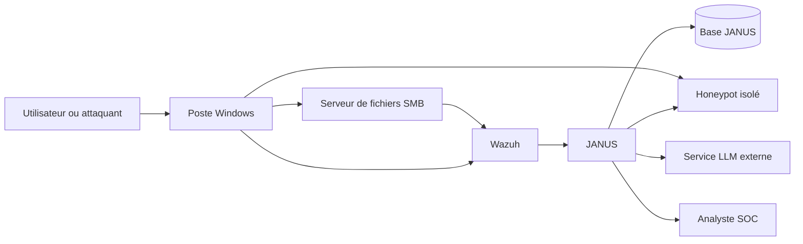

# Threat Model — JANUS v2

## 1. Objet du document

Ce document définit le modèle de menace de **JANUS v2**, une plateforme adaptative de cyberdéception multi-leurres.

JANUS v2 doit générer, déployer, superviser et corréler plusieurs catégories de leurres :

- documents et fichiers : DOCX, PDF, XLSX, CSV, ZIP, fichiers `.env`, YAML, JSON, dumps SQL ;
- identifiants leurres : comptes, clés API, tokens, identifiants SSH et chaînes de connexion ;
- services leurres : SSH, HTTP, API, SMB, bases de données ou honeypots spécialisés ;
- breadcrumbs : liens, noms de serveurs, références internes, chemins réseau et autres indices conduisant vers un leurre.

L'objectif n'est pas seulement de détecter l'ouverture d'un document, mais de reconstruire le parcours d'un acteur à travers une campagne de déception cohérente.

---

## 2. Objectif de sécurité

JANUS v2 doit permettre de répondre aux questions suivantes :

- Quel leurre a été consulté ou utilisé ?
- Depuis quel poste ou serveur ?
- Par quel utilisateur ?
- Avec quel processus ?
- À quel moment ?
- Depuis quelle adresse réseau ?
- Quel chemin l'acteur a-t-il suivi entre plusieurs leurres ?
- L'interaction est-elle probablement légitime, ambiguë, suspecte ou critique ?
- Quelles preuves justifient le verdict ?

La plateforme doit rester utile même si :

- Word bloque le contenu externe ;
- le callback HTTP ou DNS n'est jamais déclenché ;
- le LLM est indisponible ;
- un capteur secondaire tombe en panne ;
- l'acteur ne fait que copier ou télécharger un fichier sans l'ouvrir.

---

## 3. Périmètre initial du MVP

Le premier environnement ciblé est :

```text
Windows
+ Active Directory
+ serveur de fichiers SMB
+ agents Wazuh
+ serveur JANUS
+ honeypot isolé
```

Le premier scénario vertical est :

```text
Fichier leurre
    ↓
Identifiant leurre
    ↓
Faux service
    ↓
Télémétrie Wazuh / Windows / honeypot
    ↓
Corrélation
    ↓
Verdict SOC explicable
```

Exemple :

```text
Backup_Production.zip
    ↓
contient un faux fichier .env
    ↓
contient des identifiants SSH factices
    ↓
les identifiants pointent vers Cowrie
    ↓
JANUS corrèle l'accès au fichier et la tentative SSH
```

---

## 4. Actifs à protéger

### 4.1 Actifs métier

- documents RH, financiers et techniques ;
- données clients et employés ;
- informations de production ;
- sauvegardes ;
- secrets et identifiants ;
- architecture réseau ;
- dépôts de code ;
- ressources cloud ;
- systèmes d'administration.

### 4.2 Actifs de sécurité

- serveur JANUS ;
- base de données JANUS ;
- clés d'API ;
- tokens de télémétrie ;
- journaux Wazuh ;
- inventaire des actifs ;
- manifestes de déploiement ;
- règles de corrélation ;
- politiques de réponse ;
- infrastructure honeypot.

### 4.3 Actifs de confiance

- identité des utilisateurs ;
- identité des machines ;
- horodatage des événements ;
- intégrité des journaux ;
- association entre un leurre et sa cible ;
- verdicts produits par la plateforme.

---

## 5. Acteurs

### 5.1 Acteurs légitimes

- administrateur JANUS ;
- analyste SOC ;
- administrateur Wazuh ;
- administrateur Windows / Active Directory ;
- responsable métier ;
- utilisateur légitime ;
- équipe de réponse à incident ;
- équipe de test ou Red Team autorisée.

### 5.2 Adversaires

- utilisateur curieux ;
- insider malveillant ;
- attaquant ayant compromis un poste ;
- opérateur ransomware ;
- attaquant cherchant des identifiants ;
- outil automatisé de collecte de fichiers ;
- malware ;
- scanner de sécurité ;
- agent LLM ou outil de triage automatisé ;
- attaquant ayant obtenu un accès au serveur JANUS ;
- attaquant tentant de forger de faux événements.

---

## 6. Hypothèses de confiance

Le MVP suppose que :

1. Les agents Wazuh sont correctement installés et configurés.
2. Les journaux Windows sont collectés de manière fiable.
3. L'heure des machines est synchronisée.
4. Le serveur de fichiers Windows peut produire des événements d'accès.
5. Les événements Windows 4663 et SMB 5145 sont disponibles lorsque les politiques d'audit sont activées.
6. Les comptes administratifs JANUS sont protégés.
7. Les honeypots sont isolés de la production.
8. Aucun leurre ne contient de secret réel.
9. Les chemins de déploiement sont définis par une allowlist.
10. Les utilisateurs légitimes susceptibles d'accéder aux leurres sont connus ou au moins identifiables.

Ces hypothèses doivent être régulièrement vérifiées.

---

## 7. Frontières de confiance



Frontières principales :

- poste utilisateur ↔ serveur SMB ;
- réseau utilisateur ↔ infrastructure honeypot ;
- Wazuh ↔ JANUS ;
- JANUS ↔ base de données ;
- JANUS ↔ fournisseur LLM ;
- analyste SOC ↔ API d'administration.

Toute donnée traversant une frontière de confiance doit être validée, authentifiée ou considérée comme non fiable.

---

## 8. Flux de données principaux

### 8.1 Création d'une campagne

```text
Analyste SOC
    ↓
API d'administration
    ↓
Politique de campagne
    ↓
Orchestrator
    ↓
Decoy Factory
    ↓
Déploiement
    ↓
Registre des instances
```

### 8.2 Détection d'un accès à un fichier leurre

```text
Utilisateur
    ↓
Accès au fichier
    ↓
Windows 4663 / SMB 5145
    ↓
Wazuh
    ↓
Adaptateur JANUS
    ↓
SecurityEvent
    ↓
Correlation Engine
    ↓
Verdict
```

### 8.3 Utilisation d'un identifiant leurre

```text
Utilisateur ou malware
    ↓
Utilisation du secret leurre
    ↓
Cowrie / Fake API / Honeypot
    ↓
TelemetryEvent
    ↓
Correlation Engine
    ↓
Verdict critique
```

### 8.4 Callback externe

```text
Client
    ↓
Chargement éventuel du contenu distant
    ↓
Telemetry API
    ↓
Signal secondaire
    ↓
Corrélation avec les événements locaux
```

Le callback externe n'est jamais considéré comme une preuve suffisante à lui seul.

---

## 9. Modèle de données minimal

### 9.1 Campaign

- `campaign_id`
- nom
- objectif
- actifs ciblés
- politique
- date de début
- date de fin
- statut

### 9.2 DecoyInstance

- `instance_id`
- `campaign_id`
- type de leurre
- format
- chemin de déploiement
- hostname attendu
- utilisateurs ou groupes attendus
- token
- date de création
- date d'expiration
- statut
- leurres liés

### 9.3 SecurityEvent

- identifiant
- source
- horodatage
- hostname
- utilisateur
- processus
- chemin
- action
- adresse source
- événement brut

### 9.4 TelemetryEvent

- identifiant
- capteur
- instance de leurre
- horodatage
- adresse source
- type d'interaction
- payload normalisé
- confiance du capteur

### 9.5 DetectionVerdict

- niveau
- score de confiance
- raisons
- preuves
- timeline
- technique MITRE probable
- instance ou campagne associée

---

## 10. Menaces principales

### 10.1 Accès légitime interprété comme attaque

**Risque :** un utilisateur autorisé ouvre un leurre par erreur ou curiosité.

**Impact :** faux positif, perte de confiance dans la plateforme.

**Mesures :**

- définir les utilisateurs et groupes attendus ;
- prendre en compte le poste ;
- prendre en compte les horaires ;
- vérifier le processus ;
- différencier accès, copie, modification et utilisation d'un secret ;
- ne jamais classer une simple ouverture comme critique ;
- corréler plusieurs signaux.

### 10.2 Callback Word ou navigateur non déclenché

**Risque :** le client bloque le contenu externe.

**Impact :** absence de callback.

**Mesures :**

- utiliser Wazuh et Windows comme source principale ;
- considérer le beacon comme signal secondaire ;
- ne pas dépendre d'une macro ;
- ne pas promettre une détection garantie à l'ouverture ;
- détecter également copie, téléchargement, suppression et déplacement via les journaux locaux ou SMB.

### 10.3 Callback forgé

**Risque :** un attaquant appelle directement un endpoint de télémétrie.

**Impact :** faux événements et pollution de la base.

**Mesures :**

- tokens longs et aléatoires ;
- signature HMAC lorsque possible ;
- rate limiting ;
- validation stricte ;
- corrélation obligatoire avec d'autres signaux ;
- marquer un callback isolé comme confiance faible ;
- journaliser les tentatives anormales.

### 10.4 Vol ou réutilisation d'un token

**Risque :** le token est copié et déclenché ailleurs.

**Impact :** confusion sur la machine d'origine.

**Mesures :**

- token unique par instance ;
- association au poste ou emplacement attendu ;
- date d'expiration ;
- révocation ;
- corrélation avec l'événement Windows ;
- ne pas identifier une machine uniquement par adresse IP.

### 10.5 Compromission de l'API d'administration

**Risque :** un attaquant génère ou déploie des leurres arbitraires.

**Impact :** écriture de fichiers, exposition de secrets, sabotage.

**Mesures :**

- authentification forte ;
- RBAC ;
- TLS ;
- journal d'audit ;
- séparation entre API d'administration et API de télémétrie ;
- allowlist stricte des chemins ;
- validation des formats ;
- quotas ;
- interdiction d'exécuter le service avec des privilèges excessifs.

### 10.6 Path traversal ou écriture arbitraire

**Risque :** un chemin malveillant est transmis au système de déploiement.

**Impact :** écriture hors du répertoire prévu.

**Mesures :**

- allowlist de cibles ;
- résolution canonique des chemins ;
- refus des chemins relatifs ;
- refus de `..` ;
- comptes de service à privilèges minimaux ;
- validation avant toute copie.

### 10.7 Injection via le corpus ou les prompts

**Risque :** un document du corpus contient des instructions malveillantes.

**Impact :** altération du contenu généré, fuite d'informations ou comportement imprévu du LLM.

**Mesures :**

- considérer le corpus comme non fiable ;
- nettoyer les documents ;
- séparer instructions système et contexte ;
- limiter la taille ;
- filtrer les données sensibles ;
- versionner et approuver les corpus ;
- journaliser la provenance des extraits ;
- valider la sortie avant déploiement.

### 10.8 Fuite de données vers le fournisseur LLM

**Risque :** des données internes réelles sont envoyées à un service externe.

**Impact :** exposition de données sensibles.

**Mesures :**

- utiliser uniquement des données synthétiques ou préapprouvées ;
- supprimer les secrets ;
- classifier les corpus ;
- prévoir un mode local ou sans LLM ;
- journaliser les requêtes sans stocker de secrets ;
- définir une politique de fournisseurs autorisés.

### 10.9 Génération de contenu dangereux ou incohérent

**Risque :** le LLM insère de vraies adresses, des commandes dangereuses ou des informations incohérentes.

**Impact :** risque opérationnel et perte de crédibilité.

**Mesures :**

- quality gates ;
- contrôle du sujet ;
- détection de secrets ;
- listes de valeurs interdites ;
- revalidation après chaque régénération ;
- quarantaine en cas d'échec ;
- génération déterministe pour certains formats.

### 10.10 Honeypot utilisé comme pivot

**Risque :** le faux service permet d'attaquer la production.

**Impact :** compromission du réseau.

**Mesures :**

- segmentation réseau ;
- conteneurisation ou VM dédiée ;
- blocage des connexions sortantes ;
- aucune route vers la production ;
- ressources limitées ;
- collecte sécurisée ;
- réinitialisation fréquente ;
- utilisation d'outils éprouvés comme Cowrie ou OpenCanary.

### 10.11 Déni de service

**Risque :** surcharge des callbacks, génération massive ou payloads volumineux.

**Impact :** indisponibilité.

**Mesures :**

- rate limiting ;
- limites de taille ;
- files de messages ;
- quotas ;
- timeout ;
- circuit breaker pour le LLM ;
- traitement asynchrone ;
- monitoring de santé.

### 10.12 Altération des journaux

**Risque :** un attaquant modifie ou supprime les événements.

**Impact :** impossibilité de reconstruire l'incident.

**Mesures :**

- stockage append-only lorsque possible ;
- transfert rapide vers Wazuh ou un stockage central ;
- horodatage ;
- contrôle d'intégrité ;
- accès restreint ;
- conservation séparée des journaux d'audit.

### 10.13 Contournement de Wazuh

**Risque :** l'attaquant désactive l'agent ou empêche la remontée.

**Impact :** perte du signal principal.

**Mesures :**

- surveillance de l'état des agents ;
- alerte lors d'une interruption ;
- collecte serveur SMB indépendante ;
- plusieurs capteurs ;
- vérification périodique de la couverture.

### 10.14 Détection du leurre par l'attaquant

**Risque :** le document, l'identifiant ou le service paraît artificiel.

**Impact :** l'attaquant évite le leurre ou tente de manipuler la plateforme.

**Mesures :**

- cohérence du contenu ;
- métadonnées réalistes ;
- dates plausibles ;
- relations cohérentes entre les leurres ;
- services crédibles ;
- rotation ;
- absence d'indicateurs évidents ;
- tests adversariaux réguliers.

### 10.15 Attribution incorrecte à un agent LLM

**Risque :** un callback CI1 est interprété comme preuve qu'un LLM a analysé le fichier.

**Impact :** conclusion erronée.

**Mesures :**

- CI1 reste expérimental ;
- confiance faible ou moyenne ;
- User-Agent considéré comme falsifiable ;
- corrélation avec d'autres signaux ;
- aucune affirmation d'identité certaine.

---

## 11. Analyse STRIDE simplifiée

| Catégorie | Exemple dans JANUS | Contrôles |
|---|---|---|
| Spoofing | callback ou identité machine falsifiée | authentification, tokens uniques, corrélation Wazuh |
| Tampering | modification des journaux ou manifestes | intégrité, audit, permissions strictes |
| Repudiation | utilisateur nie l'accès | journaux Windows, Wazuh, horodatage |
| Information Disclosure | fuite du corpus ou des clés | minimisation, chiffrement, secrets externes |
| Denial of Service | callbacks massifs, génération abusive | quotas, rate limiting, limites |
| Elevation of Privilege | API admin exploitée | RBAC, moindre privilège, séparation des services |

---

## 12. Règles initiales de corrélation

Le moteur de corrélation doit commencer par des règles explicables.

Exemple indicatif :

```text
+40 : accès à un leurre actif
+20 : poste inattendu
+20 : utilisateur inattendu
+10 : accès hors horaires
+10 : processus inhabituel
+15 : copie depuis SMB
+15 : callback réseau corrélé
+40 : utilisation d'un identifiant leurre
+30 : interaction avec plusieurs leurres liés
-20 : poste attendu
-20 : utilisateur ou groupe autorisé
```

Niveaux :

```text
0–29   : normal
30–49  : probablement légitime
50–69  : ambigu
70–89  : suspect
90+    : critique
```

Ces valeurs devront être calibrées par des tests.

---

## 13. Scénarios de test obligatoires

### Scénario A — Ouverture légitime

- utilisateur autorisé ;
- poste attendu ;
- horaires normaux ;
- aucun autre signal.

**Résultat attendu :** événement journalisé, verdict faible.

### Scénario B — Copie depuis un poste inattendu

- chemin correspondant à un leurre ;
- poste non attendu ;
- utilisateur non autorisé.

**Résultat attendu :** verdict suspect.

### Scénario C — Contenu externe bloqué

- événement Windows présent ;
- aucun callback.

**Résultat attendu :** détection toujours fonctionnelle.

### Scénario D — Callback isolé

- callback sans événement Windows corrélé.

**Résultat attendu :** confiance faible ou événement à investiguer.

### Scénario E — Utilisation d'identifiants leurres

- accès initial au fichier ;
- tentative de connexion à Cowrie.

**Résultat attendu :** verdict critique avec timeline.

### Scénario F — Désactivation de l'agent Wazuh

- perte de télémétrie depuis un poste protégé.

**Résultat attendu :** alerte de santé du capteur.

### Scénario G — Fausse requête administrative

- appel non authentifié à l'API de génération.

**Résultat attendu :** rejet et journal d'audit.

### Scénario H — Chemin arbitraire

- tentative de déploiement hors allowlist.

**Résultat attendu :** rejet.

---

## 14. Hors périmètre

Le MVP ne doit pas :

- effectuer de hack-back ;
- exécuter du code sur la machine observée ;
- utiliser de vrais secrets ;
- prétendre identifier avec certitude une personne ;
- dépendre exclusivement du LLM ;
- dépendre exclusivement d'un callback Word ;
- déployer automatiquement en production sans validation ;
- supporter tous les formats et protocoles dès la première version ;
- remplacer un SIEM ou un EDR ;
- collecter plus de données personnelles que nécessaire.

---

## 15. Critères d'acceptation du MVP

Le MVP est accepté lorsqu'il peut :

1. créer une campagne ;
2. créer une instance unique de leurre ;
3. déployer cette instance sur une cible autorisée ;
4. recevoir un événement Wazuh relatif à cette instance ;
5. identifier le poste, l'utilisateur, le processus et le chemin lorsque disponibles ;
6. produire un verdict explicable ;
7. détecter une interaction même sans callback Word ;
8. corréler un fichier leurre avec un identifiant leurre ;
9. corréler l'utilisation de cet identifiant avec un honeypot ;
10. afficher une timeline ;
11. expirer et révoquer l'instance ;
12. rejeter les actions administratives non autorisées ;
13. continuer à fonctionner si le LLM est indisponible ;
14. conserver une trace d'audit des actions sensibles.

---

## 16. Priorités de sécurité

### Priorité 1

- authentification API ;
- allowlist des chemins ;
- séparation admin / télémétrie ;
- registre des instances ;
- événements Windows et Wazuh ;
- corrélation multi-signal.

### Priorité 2

- isolation des honeypots ;
- protection des secrets ;
- journal d'audit ;
- validation des corpus et sorties LLM ;
- rate limiting.

### Priorité 3

- haute disponibilité ;
- stockage immuable ;
- signatures avancées ;
- intégration avec plusieurs SIEM ;
- adaptation dynamique des campagnes.

---

## 17. Résumé

JANUS v2 ne doit pas être évalué selon sa capacité à faire charger une image distante par Word.

La valeur de la plateforme repose sur :

1. la diversité et la cohérence des leurres ;
2. leur traçabilité par instance ;
3. la collecte multi-capteur ;
4. la corrélation des interactions ;
5. l'explicabilité du verdict ;
6. la sécurité de l'infrastructure de déception.
