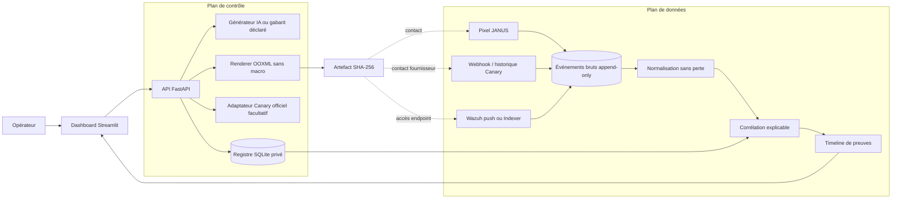

# Cahier des charges — JANUS Evidence Hub

## 1. Finalité

JANUS doit produire des documents synthétiques crédibles et collecter le maximum d’informations **réellement observables** lorsqu’ils sont touchés, sans macro Office, sans secret réel et sans inventer l’identité ou les actions d’un acteur.

Le système doit rester démontrable par un étudiant : chaque information affichée possède une source, un événement brut, une empreinte, un niveau de confiance et une limite explicite.

## 2. Objectifs fonctionnels

1. Générer un DOCX synthétique depuis une interface Streamlit.
2. Déclarer l’origine du contenu : API IA, gabarit local ou repli local.
3. Proposer quatre modes distincts : pixel JANUS, URL Canary distante, double capteur et document officiel Canary.
4. Ne jamais substituer silencieusement un capteur à un autre.
5. Télécharger un DOCX ouvrable, structurellement valide et sans macro.
6. Enregistrer le SHA-256 et le chemin exact de l’artefact.
7. Recevoir les contacts pixel, webhooks Canary et événements Wazuh.
8. Conserver le JSON brut avant toute normalisation.
9. Normaliser les champs connus sans remplir les champs absents.
10. Corréler uniquement avec des clés fortes et une fenêtre documentée.
11. Afficher les artefacts, connecteurs, preuves, événements bruts et tests contrôlés.

## 3. Non-objectifs de la première version

- identifier automatiquement une personne physique ;
- présenter une géolocalisation IP comme localisation physique ;
- exécuter du code ou une macro dans Office ;
- simuler de faux SSH, RDP ou services réseau dans le cœur JANUS ;
- effectuer du hack-back ;
- stocker de vrais identifiants dans un document ;
- confondre un User-Agent avec une preuve d’OS distant ;
- promouvoir un score probabiliste non calibré comme verdict.

## 4. Architecture cible

Streamlit ne reçoit pas directement les webhooks. FastAPI reste le point de collecte stable, même si l’opérateur change de page ou ferme le navigateur.

## 5. Modèle de vérité

### Catégories

- `observed` : fait directement vu par JANUS ou Wazuh ;
- `reported` : fait déclaré par un fournisseur externe ;
- `controlled` : événement produit volontairement pour tester le pipeline ;
- `inferred` : conclusion dérivée, accompagnée de sa règle et de ses limites.

### Force

- `confirmed` : le fait décrit correspond directement au signal ;
- `corroborated` : plusieurs signaux indépendants partagent des clés fortes ;
- `candidate` : signal utile mais insuffisant pour la conclusion ;
- `unsupported` : brut conservé, normalisation ou conclusion non prise en charge.

### Confiance du transport

- `verified` : secret d’ingestion, requête Indexer authentifiée ou historique fournisseur géré ;
- `unverified` : charge reçue sans preuve suffisante de son émetteur ;
- `invalid` : authentification rejetée ; l’événement n’entre pas dans la timeline.

Ces trois axes restent séparés. Un transport vérifié ne transforme pas une inférence faible en fait confirmé.

## 6. Règles minimales de corrélation

| Règle | Conditions | Résultat |
| --- | --- | --- |
| C1 | 4663 + 4688 ou Sysmon 1, même hôte, même Logon ID, ±5 s | `corroborated` |
| C2 | 5145 avec fichier correspondant | accès SMB `confirmed` |
| C3 | 4663 seul sur chemin exact | accès fichier `candidate` |
| C4 | Canary authentifié + token géré | contact fournisseur `confirmed` |
| C5 | proximité temporelle seule | événements séparés, aucune fusion |

## 7. Sécurité

- validation stricte des URL et chemins ;
- stockage des artefacts sous une racine unique ;
- vérification SHA-256 au téléchargement ;
- absence de `vbaProject.bin` ;
- routes administratives protégées hors localhost ;
- secret obligatoire pour l’ingestion Wazuh réelle ;
- suppression des en-têtes Authorization/Cookie dans la preuve pixel ;
- base, `.env`, artefacts et sauvegardes exclus de Git ;
- données synthétiques uniquement dans les documents ;
- secrets de gestion Canary jamais présents dans les réponses publiques.

## 8. Critères d’acceptation

La première version est acceptée si :

1. `python run.py` lance l’API et le dashboard ;
2. un clic produit un DOCX téléchargeable ;
3. le DOCX s’ouvre sans réparation et ne contient aucune macro ;
4. les modes local, distant et double produisent des relations distinctes ;
5. un test pixel apparaît comme `controlled` ;
6. un événement Wazuh 4663 réel est stocké avec son JSON et son SHA-256 ;
7. un 4663 + 4688 correctement liés deviennent `corroborated` ;
8. un ID Wazuh inconnu reste visible en `normalization_pending` ;
9. un webhook Canary non authentifié ne devient pas une preuve confirmée ;
10. tous les tests automatiques réussissent hors réseau.

## 9. Éléments repris de la version historique

- idée du dashboard Streamlit, mais sans boucle de rafraîchissement bloquante ;
- génération compatible OpenAI/Groq et fallback déclaré ;
- mapping Canary Word officiel et validation du conteneur ;
- SQLite en WAL avec écritures transactionnelles ;
- normalisation 4624/4663/4688/5145 et Sysmon ;
- collecte facultative de Wazuh Indexer ;
- corrélation par chemin exact, hôte et Logon ID ;
- scripts d’audit Windows et règles Wazuh génériques.

## 10. Éléments volontairement non repris

- faux services SSH/HTTP ;
- credentials crédibles présentés comme mécanisme équivalent au document ;
- prédiction d’OS à partir d’un User-Agent ;
- scoring opaque ;
- rotation automatique avant validation de la chaîne minimale ;
- prompt caché destiné à influencer un agent IA.

